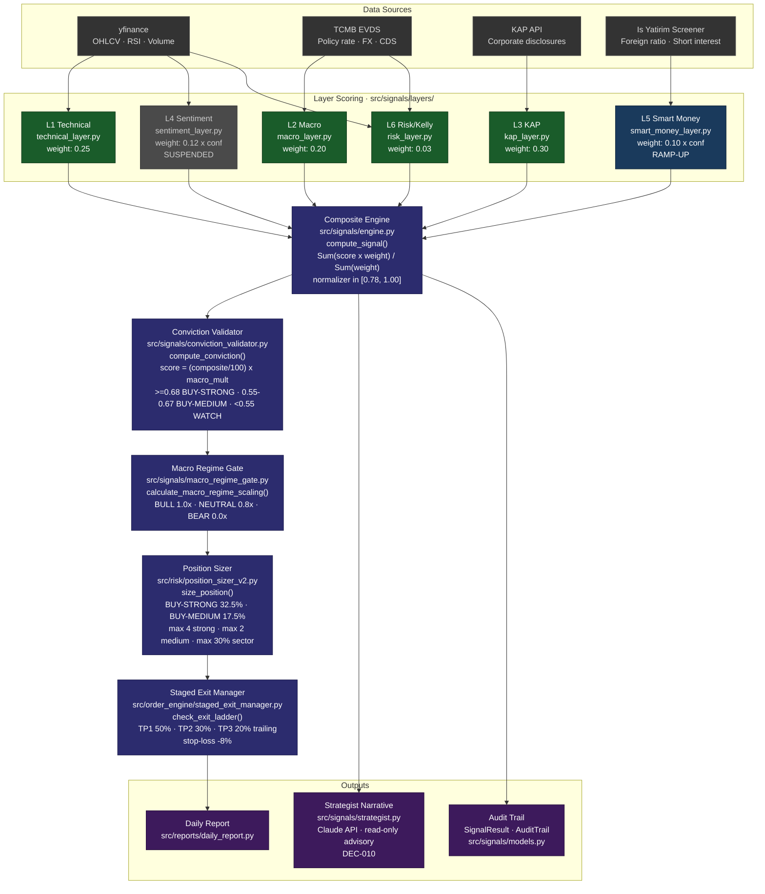
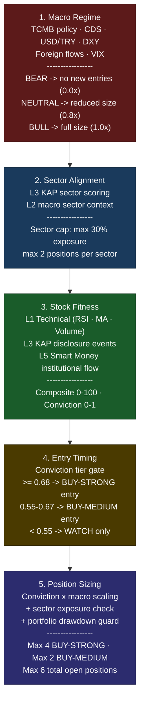

# BIST OS — Architecture

**System:** BIST OS Algorithmic Trading System
**Version:** Phase 4.5 (Production)
**Last Updated:** 2026-05-19

---

## 1. Full Signal Pipeline



---

## 2. Druckenmiller Macro-First Hierarchy



---

## 3. Layer Detail Reference

### L1 — Technical Layer (`src/signals/layers/technical_layer.py`)

Scores price action and momentum on a 0-100 scale. Inputs: OHLCV from yfinance.

Key signals: RSI (14), 20/50/200-day moving averages, volume surge ratio, Bollinger Band position. Outputs a single `LayerScore` with `source="computed"` when data is available, `source="missing"` on fetch failure.

### L2 — Macro Layer (`src/signals/layers/macro_layer.py`)

Scores the Turkish macro environment. Inputs from `src/signals/local/` client modules:

| Sub-signal | Source | Weight in L2 |
|-----------|--------|-------------|
| USD/TRY direction | yfinance | 0.25 |
| VIX level | yfinance | 0.20 |
| Brent crude | yfinance | 0.15 |
| S&P 500 | yfinance | 0.15 |
| BIST100 | yfinance | 0.15 |
| Foreign flows (weekly) | Is Yatirim | 0.20 |
| DXY | yfinance (Gap 3) | 0.25 |

L2 score also drives conviction macro multiplier (separate from the macro gate).

### L3 — KAP Layer (`src/signals/layers/kap_layer.py`)

Highest-weight layer (0.30) — reflects BIST's information asymmetry dynamic where corporate disclosures frequently precede price moves. Parses KAP events by category (dividends, capital increases, financial results, material events, insider transactions) and scores their directional impact within a configurable lookback window.

### L4 — Sentiment Layer (`src/signals/layers/sentiment_layer.py`) — SUSPENDED

FinBERT-based Turkish financial news sentiment. Suspended because no reliable Turkish-language financial news feed has been integrated. When active: confidence scales with article count and recency; at confidence=0 the effective weight is 0 and the composite is unaffected (DEC-009). Social media scope (X, Telegram, BIST forums) deferred to Phase 5.

### L5 — Smart Money Layer (`src/signals/layers/smart_money_layer.py`) — RAMP-UP

Institutional flow detection from Is Yatirim foreign ratio screener + short interest data. Two sub-signals:

- **Foreign ratio trend** (`L5_FOREIGN_WEIGHT = 0.70`) — weekly directional change
- **Short interest** (`L5_SHORT_INT_WEIGHT = 0.30`) — inverse relationship (high short = bearish)

Bull trap override: triggers confidence reduction when technical score is high but institutional flow is negative. Returns `confidence=0` until minimum data history is accumulated (~Day 10-20 of data collection).

### L6 — Risk/Kelly Layer (`src/signals/layers/risk_layer.py`)

Lowest-weight layer (0.03) — acts as a position guard, not a primary signal. Kelly fraction estimate based on historical hit rate and payoff ratio. Also drives `detect_regime()` which classifies macro environment as `BULL`, `NEUTRAL`, `BEAR`, or `RISK_OFF`.

`RISK_OFF` triggers an engine-level override: all BUY signals become HOLD regardless of composite score (`engine.py:_apply_regime_filter()`).

---

## 4. Conviction System Detail

```
composite (0-100)
    |
    |  / 100
    v
base_score (0-1.0)
    |
    |  x macro_multiplier
    |    L2 >= 65 -> 1.2
    |    L2 >= 50 -> 1.0
    |    L2 < 50 -> 0.85
    v
conviction_score (0-1.0, capped at 1.0)
    |
    +--> >= 0.68  --> BUY-STRONG  --> 32.5% base allocation
    +--> >= 0.55  --> BUY-MEDIUM  --> 17.5% base allocation
    +-->  < 0.55  --> WATCH        --> no entry
```

Position sizing then applies a second macro scaling pass (macro regime gate) and checks sector concentration caps before returning a final allocation percentage.

---

## 5. Constants Architecture

All numeric parameters are centralized in `src/signals/thresholds.py`. No hardcoded values are permitted in engine, layer, or risk modules. Architecture tests (`tests/test_architecture.py::TestThresholdsSingleSource`) enforce this invariant on every test run.

```
src/signals/thresholds.py
+-- MASTER_WEIGHTS          # L1-L6 base weights (sum = 1.00)
+-- SIGNAL_THRESHOLDS       # buy_strong/buy_weak/hold_lower/sell_weak
+-- CONVICTION_STRONG       # 0.68
+-- CONVICTION_MEDIUM       # 0.55
+-- MACRO_GATE_BULL_MIN     # 60.0
+-- MACRO_GATE_NEUTRAL_MIN  # 45.0
+-- POSITION_SIZE_STRONG    # 0.325
+-- POSITION_SIZE_MEDIUM    # 0.175
+-- EXIT_STOP_LOSS          # 0.92  (-8%)
+-- EXIT_PROFIT_TARGET      # 1.20  (+20%)
+-- TP1/TP2/TP3_PCT_EXIT    # 0.50 / 0.30 / 0.20
+-- RISK_OFF_CONDITIONS     # VIX, USD/TRY, BIST100 thresholds
```

---

## 6. Test Architecture

```
tests/
+-- test_architecture.py   # Tier 1 - design invariants (7 tests)
|   +-- TestThresholdsSingleSource   (no hardcoded values in engine.py)
|   +-- TestWeightSumValid           (MASTER_WEIGHTS sum in [0.85, 1.05])
|   +-- TestSingletonPattern         (LocalMacroSignals singleton)
|   +-- TestL5VerdaIndependence      (L5 core is vendor-free)
+-- test_signal_alert.py   # Tier 2 - integration (7 tests)
+-- test_backtest.py       # Tier 2 - integration (22 tests)
+-- test_*.py (39 files)   # Tier 3 - unit tests (~700 tests)
```

Total: **742 passing, 1 skipped** (as of Phase 4.5, commit 9c9bbcb).

---

*docs/ARCHITECTURE.md — BIST OS v4.5 — 2026-05-19*
