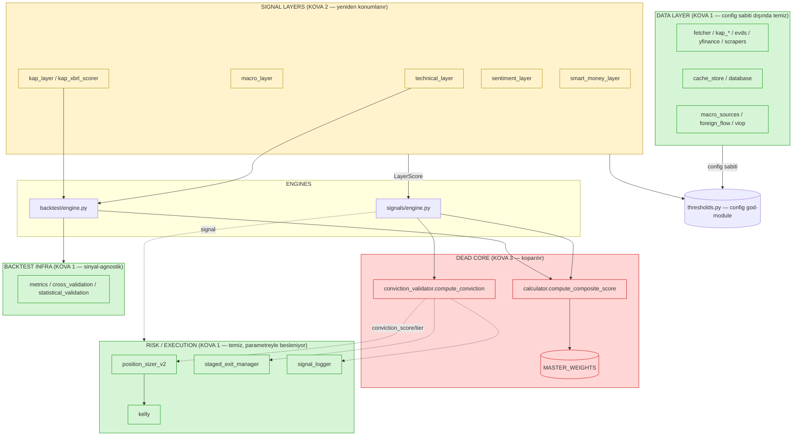

# PIVOT ARCHITECTURE AUDIT — BIST OS

**Tarih:** 2026-05-29
**Tür:** Salt-okuma mimari denetimi (hiçbir kod değiştirilmedi)
**Amaç:** "Sıfırdan repo mu / in-place refactor mı" kararının ve Architect SPEC'inin temel girdisi
**Yöntem:** 3 paralel Explore ajanı + kritik dosyaların doğrudan okunması + `grep`/`pytest --collect-only` ile sayıların doğrulanması. Aşağıdaki tüm sayılar kanıtlanmıştır; "muhtemelen" yoktur.

---

## PİVOT BAĞLAMI

**Eski mimari (TERK EDİLİYOR):** 5-katman linear-additive composite
`MASTER_WEIGHTS · L1..L5 → ağırlıklı toplam (composite 0-100) → conviction = (composite/100)×macro_mult → tier (≥0.68 / 0.55) → sinyal`

**Yeni mimari (HEDEF):** Tarama-öncelikli quantamental
- **KATMAN A — TARAMA** (deterministik+kantitatif): 100 hisse → öne çıkan 5-10. Ardışık filtre veya rank — composite DEĞİL.
- **KATMAN B — LLM ASİSTAN** (bağlayıcı değil): KAP/haber → özet+hipotez.
- **KATMAN C — İCRA** (deterministik kanun): Kelly + ADV + stop + net EV.
- **KATMAN D — MAKRO ŞALTER:** portföy beta exposure (hisse filtresi değil).

---

## 0. ÖZET — Q1-Q5 HIZLI CEVAP

| # | Soru | Cevap | Kanıt |
|---|------|-------|-------|
| **Q1** | `backtest/engine.py` composite ne kadar derin? Refactor mı, rewrite mı? | **REFACTOR.** Composite yüzeyi 573 satırın ~60-80'i. Loop harness'ı (portföy, exit, execution, makro kriz gate) composite'ten bağımsız ve doğrudan yeniden kullanılabilir. | `engine.py:208-209, 257-303, 333-342, 365-377` vs. composite-free `engine.py:379-523` |
| **Q2** | `MASTER_WEIGHTS` kaç dosyada? Koparmak ne kadar yayılır? | **27 .py dosyası** referans (12 src production). Çoğu tek satırlık ağırlık damgası. `thresholds.py` İSE 45 dosyada import edilir — ama dead-core sadece weights/SIGNAL_THRESHOLDS/CONVICTION_* alt kümesi; thresholds.py'nin geri kalanı (path/TTL/config) yaşar. | `grep MASTER_WEIGHTS` = 27; `grep thresholds import` = 45 |
| **Q3** | KOVA 1 (korunacak), KOVA 3'e (ölecek) ne kadar bağımlı? Temiz ayrılıyor mu? | **TEMİZ AYRILIYOR.** Risk/icra modülleri conviction'ı *girdi parametresi* olarak alır, engine/calculator import etmez. Data layer'ın src.signals bağı yalnızca config sabitleri. | `position_sizer_v2.py`, `kelly.py`, `staged_exit_manager.py` import grafiği |
| **Q4** | 1456 testin ne kadarı composite/conviction'a bağlı? | **Toplam 1.467 test** (gerçek sayım). composite/conviction/MASTER_WEIGHTS terimleri 22 dosyada. Sert ölüm ~150-250 test bandında (kesin sayı refactor sonrası belli olur), gerisi adapte edilir. | `pytest --collect-only` = 1467; `grep tests/` = 22 dosya |
| **Q5** | Sıfırdan repo mu, in-place refactor mı? | **IN-PLACE REFACTOR (strangler).** KOVA 1 temiz ayrıldığı, composite yüzeyi dar olduğu ve harness korunduğu için sıfırdan repo gereksiz risk. KARAR the maintainer'IN. | Q1-Q4 birleşimi |

**Tek cümlelik teşhis:** Ölü linear-additive çekirdek, sağlam parçalardan **temiz ayrılabilir bir adacık** — 3 production dosyada hesaplanıyor, geri kalan her şey ya config sabiti ile ya da girdi parametresi ile gevşek bağlı. Sıfırdan başlamayı haklı çıkaracak "derin gömülme" YOK.

---

# ÇIKTI 1 — DEPENDENCY MAP

## 1.1 Genel istatistikler (doğrulanmış)

- **130 Python dosyası** `src/` altında.
- **44 yaprak modül** (hiçbir iç `src.*` modülü import etmeyen saf util/leaf).
- **0 döngüsel bağımlılık** — graf temiz bir DAG (Explore ajanı adjacency analizi; aşağıdaki listeden manuel teyit edilebilir).
- **45 dosya** `src.signals.thresholds`'i import eder → en yüksek in-degree "god-module".

## 1.2 Alt-sistem seviyesi graf (mermaid)



**Okuma:** Kesikli oklar (`-.->`) = gevşek bağ (parametre/sinyal, doğrudan import değil). Kırmızı ada (DEAD CORE) yalnızca iki engine'den ve calculator'dan beslenir; KOVA 1 (yeşil) ona ya hiç bağlı değil ya da parametre üzerinden bağlı.

## 1.3 Tam adjacency list (A → B: A, B'yi import eder)

> İç `src.*` bağımlılıkları. Harici (pandas/numpy/requests/anthropic vb.) hariç.

```
src.analysis.momentum            → analysis.technicals, utils.logger
src.analysis.portfolio           → analysis.technicals, utils.config, utils.logger
src.analytics.brinson_attribution→ data.database
src.analytics.ic_calculator      → signals.thresholds
src.analytics.ic_history         → analytics.ic_calculator, signals.thresholds
src.analytics.kap_xbrl_scorer    → data.kap_historical_fetcher, data.short_interest_normalizer
src.analytics.layer_attribution  → analytics.ic_calculator, signals.thresholds      [MASTER_WEIGHTS]
src.analytics.nav_calculator     → signals.thresholds
src.analytics.nav_zscore         → signals.thresholds
src.backtest.cross_validation    → backtest.validation_constants
src.backtest.data_loader         → backtest.validation_constants, signals.thresholds
src.backtest.engine              → analytics.kap_xbrl_scorer, backtest.data_loader, data.macro_sources,
                                    signals.calculator, signals.layers.bist_trend_scalar,
                                    signals.layers.technical_layer, signals.thresholds   [DEAD-CORE]
src.backtest.metrics             → backtest.engine, backtest.validation_constants
src.backtest.statistical_validation → backtest.cross_validation, backtest.metrics, backtest.validation_constants
src.data.bist_datastore_client   → signals.thresholds                               [config sabiti]
src.data.bist_datastore_parser   → signals.thresholds                               [config sabiti]
src.data.database                → utils.config, utils.logger
src.data.fetcher                 → utils.config, utils.logger
src.data.fintables_scraper       → signals.thresholds                               [config sabiti]
src.data.foreign_flow_parser     → signals.thresholds                               [config sabiti]
src.data.isyatirim_scraper       → signals.layers.connectors.smart_money_connector, signals.thresholds
src.data.isyatirim_short_interest_parser → signals.thresholds                       [config sabiti]
src.data.kap_client_edge_case    → data.bist_calendar, data.kap_cache_manager, data.kap_fetcher, data.kap_queue
src.data.kap_fetcher             → data.kap_client
src.data.kap_historical_fetcher  → data.kap_api_client, data.yfinance_fundamentals_fetcher
src.data.kap_parser              → data.kap_client, data.kap_fetcher
src.data.kap_scheduler           → data.database, data.kap_fetcher, data.kap_parser, utils.config
src.data.macro_feed              → utils.config, utils.logger
src.data.macro_scheduler         → data.macro_feed, utils.config, utils.logger
src.data.macro_sources           → data.evds_client, signals.thresholds            [config sabiti]
src.data.news_fetcher            → signals.thresholds                               [config sabiti]
src.data.signal_logger           → data.bist_calendar, signals.models, signals.thresholds  [conviction tüketici]
src.data.universe_snapshot       → data.fetcher, signals.thresholds                 [config sabiti]
src.data.viop_fetcher            → signals.thresholds                               [config sabiti]
src.nlp.finbert_analyzer         → data.lexicon.turkish_financial_lexicon, nlp.sentiment_model, signals.thresholds
src.order_engine.staged_exit_manager → portfolio.monitor, risk.technical_level_detector,
                                       signals.macro_regime_gate, signals.thresholds  [conviction tüketici]
src.portfolio.monitor            → risk.stop_calculator, signals.thresholds
src.reporting.alpha_attribution  → signals.thresholds
src.reporting.ic_dashboard       → analytics.ic_calculator, analytics.layer_attribution, reporting.alpha_attribution, signals.thresholds
src.reports.daily_report         → analysis.portfolio, risk.transaction_cost, signals.thresholds, utils.config, utils.logger
src.risk.correlation_matrix      → signals.thresholds
src.risk.position_sizer_v2       → risk.transaction_cost, signals.thresholds        [conviction tüketici — PARAMETRE]
src.risk.stop_calculator         → risk.technical_level_detector, signals.thresholds
src.risk.technical_level_detector→ signals.thresholds
src.risk.transaction_cost        → signals.thresholds
src.risk.volatility              → signals.thresholds
src.scrapers.kap_scraper         → scrapers.kap_models, scrapers.kap_parser, utils.logger
src.signals.calculator           → signals.thresholds                              [DEAD-CORE: compute_composite_score]
src.signals.conviction_validator → signals.thresholds                              [DEAD-CORE: compute_conviction]
src.signals.engine               → signals.calculator, signals.conviction_validator, signals.layers.*,
                                    signals.models, signals.regime_hmm, signals.thresholds  [DEAD-CORE omurga]
src.signals.layers.kap_layer     → signals.layers.kap_earnings_parser, signals.models, signals.thresholds  [MASTER_WEIGHTS]
src.signals.layers.macro_layer   → data.foreign_flow_parser, signals.local.cache_store,
                                    signals.local_macro_signals, signals.models, signals.thresholds  [MASTER_WEIGHTS]
src.signals.layers.risk_layer    → signals.models, signals.thresholds              [MASTER_WEIGHTS — L6 stub]
src.signals.layers.sentiment_layer → signals.models, signals.sentiment.sentiment_signal, signals.thresholds  [MASTER_WEIGHTS]
src.signals.layers.smart_money_layer → signals.layers.connectors.smart_money_connector, signals.thresholds
src.signals.layers.technical_layer → signals.models, signals.thresholds            [MASTER_WEIGHTS]
src.signals.layers.viop_layer    → data.viop_fetcher, signals.models, signals.thresholds
src.signals.local.*              → signals.local.cache_store, signals.models, signals.thresholds, data.*
src.signals.regime_hmm           → data.database, signals.thresholds               [MASTER_WEIGHTS — HMM override]
src.signals.macro_regime_gate    → signals.thresholds                              [Layer D adayı — TEMİZ]
src.utils.logger                 → utils.config
src.utils.weight_validator       → signals.thresholds                              [MASTER_WEIGHTS — invariant]
```

## 1.4 Top hub'lar (in-degree)

| Sıra | Modül | In-degree | Not |
|------|-------|-----------|-----|
| 1 | `signals.thresholds` | 45 | Config god-module. Dead-core DEĞİL bütünü; sadece weights/SIGNAL_THRESHOLDS/CONVICTION_* alt kümesi ölür. |
| 2 | `signals.models` | ~10 | `LayerScore`, `SignalResult`, `AuditTrail`, `ConflictInfo` — dataclass'lar. |
| 3 | `signals.layers.connectors.smart_money_connector` | ~8 | Connector interface. |
| 4 | `utils.config` / `utils.logger` | 7 / 7 | Cross-cutting. |
| 5 | `data.kap_client` / `data.fetcher` | 6 / 6 | Veri orkestrasyonu. |
| 6 | `data.database`, `backtest.validation_constants`, `backtest.engine` | 5 | — |

## 1.5 Yaprak modüller (saf util — 44 adet, seçilmiş)

`analysis.technicals`, `data.bist_calendar`, `data.cds_fetcher`, `data.kap_cache_manager`, `data.kap_queue`, `data.short_interest_normalizer`, `data.smart_money_client`, `data.viop_takasbank_parser`, `data.yfinance_fundamentals_fetcher`, `nlp.sentiment_model`, `risk.circuit_breaker`, `risk.drawdown`, `risk.kelly`, `risk.portfolio_heat`, `signals.local.cache_store`, `signals.models`, `signals.strategist`, `signals.thresholds`, `utils.config` …

→ Bu yapraklar **hiçbir composite/conviction mantığına dokunmaz**; pivot sonrası olduğu gibi taşınır.

## 1.6 ⚠ "Self-referential import" uyarısı

Explore ajanı 9 modülde (`evds_client`, `kap_client`, `kap_api_client`, `macro_sources`, `tcmb_scraper`, `kap_historical_fetcher`, `fintables_scraper`, `ic_calculator`, `kap_xbrl_scorer`) kendine-import işaretledi. Bunlar **gerçek döngü değil** — büyük olasılıkla lazy-import / re-export / `TYPE_CHECKING` blokları veya grep eşleşmesi. Graf DAG olduğundan (0 döngü) yapısal risk yok; ancak refactor sırasında bu satırlar gözden geçirilmeli. **Spekülatif — execute öncesi doğrulanmalı.**

---

# ÇIKTI 2 — KOVA SINIFLANDIRMASI

## 2.1 KOVA 1 — KORUNUR (yeni mimaride doğrudan yaşar)

| Modül | Dosya | Gerekçe |
|-------|-------|---------|
| **Veri fetcher/parser'ları** | `data/fetcher.py`, `data/kap_*.py`, `data/evds_client.py`, `data/yfinance_fundamentals_fetcher.py`, `data/macro.py`, `data/smart_money_client.py`, `data/isyatirim_*.py`, `data/foreign_flow_parser.py`, `data/viop_*.py`, `data/bist_datastore_*.py`, `data/news_fetcher.py` | src.signals'a tek bağ **config sabiti** (path/TTL/lookback). Composite/engine import etmez. → Katman A/B/C/D'nin veri tabanı. |
| **Cache & DB** | `data/cache_store.py` (LocalMacroSignals singleton), `data/database.py`, `signals/local/*` | Saf altyapı; sinyal-agnostik. |
| **Risk/icra** | `risk/kelly.py`, `risk/position_sizer_v2.py`, `risk/stop_calculator.py`, `risk/technical_level_detector.py`, `risk/drawdown.py`, `risk/volatility.py`, `risk/transaction_cost.py`, `risk/correlation_matrix.py`, `risk/circuit_breaker.py`, `risk/portfolio_heat.py` | **→ Katman C'nin gövdesi.** conviction'ı *girdi* alır (Q3). ADV cap (`apply_adv_cap`, D-145), net EV (`net_expected_value_check`, D-146) hazır. |
| **İcra orkestrasyonu** | `order_engine/staged_exit_manager.py`, `portfolio/monitor.py` | Staged TP + forced exit. conviction/regime *parametre*. |
| **Backtest infra (sinyal-agnostik)** | `backtest/metrics.py`, `backtest/cross_validation.py` (Purged K-Fold), `backtest/statistical_validation.py` (DSR/PBO/CPCV/Newey-West), `backtest/data_loader.py`, `backtest/validation_constants.py` | equity/trades girdi alır, composite bilmez. **→ Katman A/C'nin doğrulama altyapısı, aynen.** |
| **Kantitatif faktör kaynakları** | `analysis/technicals.py`, `analysis/momentum.py` (ADX, RSI, MA, momentum, volume_surge, 52w proximity), `data/short_interest_normalizer.py` (`compute_universe_percentiles` — cross-sectional rank!) | **→ Katman A tarama faktörlerinin ham kaynağı.** Layer skorlamasından ÖNCE üretiliyor. |
| **NAV/raporlama** | `analytics/nav_calculator.py`, `analytics/nav_zscore.py` | Portföy takibi; engine import etmez (architecture test ile korunuyor). |
| **Test suite (büyük çoğunluk)** | `tests/test_data*`, `test_kap*`, `test_kelly`, `test_position_sizer_v2`, `test_stop_calculator`, `test_backtest_metrics`, `test_cross_validation`, `test_ic_framework` … | Veri/risk/infra testleri composite'ten bağımsız. |

## 2.2 KOVA 2 — YENİDEN KONUMLANIR (kod yaşar, bağlantı değişir)

| Layer | Dosya | ŞU AN neye bağlı | YENİ rol & bağ |
|-------|-------|------------------|----------------|
| **L2 macro** | `signals/layers/macro_layer.py` + `signals/macro_regime_gate.py` (`classify_regime`) | `MASTER_WEIGHTS["macro"]`, composite'e `score_macro()` girer; conviction `macro_multiplier`'ı besler | **→ KATMAN D (makro şalter).** `macro_regime_gate.py` zaten ayrı, temiz; `score_macro` LayerScore yerine binary/scalar rejim çıktısı kullanılır. Portföy beta exposure, per-stock değil. |
| **L3 KAP/XBRL** | `signals/layers/kap_layer.py` (event), `signals/layers/kap_earnings_parser.py`, `analytics/kap_xbrl_scorer.py` (cross-sectional surprise) | `MASTER_WEIGHTS["kap"]`, composite'e `score_kap()`/`score_xbrl_surprise()` girer | **→ KATMAN A faktörü** (XBRL cross-sectional rank — en hazır) **+ KATMAN B bağlamı** (KAP event özeti LLM'e). |
| **L4 sentiment** | `signals/layers/sentiment_layer.py`, `signals/sentiment/*`, `nlp/finbert_analyzer.py` | `MASTER_WEIGHTS["sentiment"]`, composite'e `score_sentiment()` girer (conf=0, SUSPENDED) | **→ KATMAN B (LLM asistan girdisi, bağlayıcı değil).** NLP modelleri korunur; LayerScore wrapper'ı kalkar, ham haber/sentiment LLM'e gider. |
| **L5 smart_money** | `signals/layers/smart_money_layer.py` (`SmartMoneyL5`, `SmartMoneyNormalizer`) | `MASTER_WEIGHTS["smart_money"]`, composite'e `compute_l5_score()` girer (terfi adayı) | **→ KATMAN A faktörü (terfi).** `compute_percentile_score`/`SmartMoneyNormalizer` rolling-rank zaten var; `is_adv_eligible` zaten boolean filtre. |
| **L6 risk** | `signals/layers/risk_layer.py` | `MASTER_WEIGHTS.get("risk", 0.0)` — composite'ten **zaten çıkarılmış (D-154)** | Pozisyon boyutlandırmada (Kelly/vol scalar) yaşamaya devam → KATMAN C. Composite stub'ı silinir. |
| **L1 technical** | `signals/layers/technical_layer.py` | `MASTER_WEIGHTS["technical"]`, composite'e `score_technical()` girer | **→ KATMAN A** (trend/likidite/RS filtreleri). Ham faktörler `detail` + upstream `analysis/`'te. |
| **IC/attribution** | `analytics/ic_calculator.py`, `analytics/layer_attribution.py`, `data/signal_logger.py`, `reporting/ic_dashboard.py` | Layer skor kolonları + `MASTER_WEIGHTS` | **→ Katman A faktör IC'sine adapte** (l1_tech_score yerine trend_adx_ic vb.). signal_logger şeması conviction yerine yeni karar alanlarını loglar. |

### 2.2.1 ⭐ Layer çıktı formatı → Tarama (Katman A) interface uyumu

**KRİTİK BULGU:** Her layer, sub-faktörlerini **içeride kendi mini ağırlıklı-toplamıyla** tek bir 0-100 skora çökertiyor — pivotun master seviyede terk ettiği linear-additive desen, layer seviyesinde tekrarlanıyor. `.weight` alanını düşürmek bunu çözmez; gerçek soru: **rolled-up skoru mu, ham faktörleri mi tüketiyoruz?**

| Layer | Şu anki çıktı | Ham faktör nerede | Cross-sectional? | Filtre-ready? | Rank-ready? |
|-------|---------------|-------------------|:---:|:---:|:---:|
| **L1 technical** | `LayerScore.score` 0-100 = regime-ağırlıklı ort.(rsi/ma/momentum/volume/proximity) — `technical_layer.py:196-204` | `detail` dict: `adx`, `volume_surge`, `momentum_score`, `proximity_52w_high`, `ma_*_above`; ayrıca upstream `analysis/momentum.py` + `build_technical_data` | Hayır (per-stock) | **Evet** (ham faktörler açık) | Evet (faktör başına) |
| **L3 kap event** | `LayerScore.score` = `KAP_BASE + Σ kategori impact` (additive) — `kap_layer.py:60-92` | `detail`: `categories`, `events`, `high_priority` | Hayır (event-driven) | Kısmi (kategori boolean) | Zayıf |
| **L3 XBRL** | `score_xbrl_surprise()` → **[-40,+40] cross-sectional percentile impact** — `kap_xbrl_scorer.py:85-132` | `build_universe_xbrl_snapshot` evren DataFrame'i | **EVET (native rank)** | Evet | **Evet (native)** |
| **L5 smart_money** | `compute_l5_score()` → bare `float\|None` = `0.6×percentile + 0.4×momentum` + short-int blend — `smart_money_layer.py:1016-1046` | standalone metodlar: `compute_percentile_score`, `compute_momentum_score`, `compute_level_score`, `compute_30d_change_score`; boolean gate: `is_adv_eligible`, `OutlierGuard.is_signal_eligible` | Kısmi (rolling-rank) | **Evet** (`is_adv_eligible`) | **Evet** (`SmartMoneyNormalizer`) |
| **L2 macro** | `LayerScore.score` 0-100 (engine'de `macro_multiplier`'a) | `macro_regime_gate.classify_regime` ayrı | Hayır (tek durum) | Evet (rejim boolean) | N/A |
| **L4 sentiment** | `LayerScore.score` 0-100, `confidence=0` SUSPENDED | `finbert_analyzer` ham çıktı | Hayır | N/A | N/A |

**Interface uyumu — net cevap (research'e doğrudan girdi):**

- **Eğer Katman A = ardışık filtre seçilirse:** rolled-up 0-100 `score` **YANLIŞ interface** — çok kaba ve içinde gömülü ağırlık taşır; `ADX>25 VE ADV>20M VE RS>üst-çeyrek` gibi bağımsız eşikler kurulamaz. Katman A **ham sub-faktörleri** tüketmeli:
  - Trend → `technical.detail["adx"]` (veya doğrudan `analysis/` ADX hesabı)
  - Likidite → `is_adv_eligible()` (zaten boolean filtre) / `volume_surge`
  - RS/momentum → `technical.detail["momentum_score"]` / `compute_momentum_score`
  - Takas/yabancı → `compute_percentile_score` / `compute_level_score`
- **Eğer Katman A = ağırlıklı-skor/rank seçilirse:** rolled-up 0-100 skorlar **doğrudan rank input** olur (evreni `score`'a göre sırala); XBRL scorer zaten cross-sectional. Interface değişimi minimal.
- **Cross-sectional altyapı green-field DEĞİL:** `compute_universe_percentiles` (`data/short_interest_normalizer.py`), `SmartMoneyNormalizer._rolling_percentile`, `compute_percentile_score` rank primitive'leri mevcut. **`score_xbrl_surprise` tüm Katman A faktör-skorlaması için referans şablon.**
- **`confidence`/`None` → filtre uyumu hazır:** Bugünkü `confidence==0` (L4 suspend) ve `compute_l5_score → None` (veri yok/stale/ADV-dışı) semantiği, ardışık-filtre dünyasında doğal "filtreden geçemedi / hariç" anlamına gelir.

**Özet:** ardışık-filtre vs ağırlıklı-skor research kararı = **"ham sub-faktör tüket" vs "rolled-up skoru rank'le"** kararı. İki yol da mevcut primitive'lerle uygulanabilir; ham-faktör yolu daha fazla refactor ama pivotun ruhuna (composite'ten kaçış) sadık.

## 2.3 KOVA 3 — KOPARILIR (ölü linear-additive bağ)

| Bileşen | Dosya:satır | Koparınca ETKİLENEN (blast radius) |
|---------|-------------|-----------------------------------|
| **`MASTER_WEIGHTS` composite formülü** | `thresholds.py:22-29` (tanım) | 27 .py dosyası referans verir. 12 src production: calculator, engine, backtest/engine, regime_hmm, weight_validator, signals/__init__, layer_attribution + 6 layer (`_w("...")` damgası). **Çoğu mekanik tek-satır silme.** thresholds.py'nin geri kalanı (path/TTL/config) yaşar. |
| **`compute_composite_score`** | `calculator.py:26-53` | Yalnızca `engine.py:339` (`_compute_weighted_sum`) ve `backtest/engine.py:293` çağırır. **2 çağrı sitesi.** Saf fonksiyon — silmesi izole. |
| **`compute_conviction` + tier (≥0.68/0.55)** | `conviction_validator.py:48-63`; eşikler `thresholds.py` (CONVICTION_*) | `engine.py:344` çağırır. Çıktı `conviction_score`/`conviction_tier` → `position_sizer_v2`, `staged_exit_manager`, `signal_logger`, `models.AuditTrail/SignalResult`. **Bu tüketiciler parametreyle alır** → conviction üretimi değişse de interface korunabilir (sessiz kırılma riski DÜŞÜK, ama alanlar boş kalırsa downstream default'a düşer — dikkat). |
| **`_composite_to_signal` / `signal_from_composite`** | `backtest/engine.py:333-342`, `calculator.py:66-80` | SIGNAL_THRESHOLDS (buy_strong 72 / buy_weak 60 …) ile sinyal üretir. Katman A kararı ile değişir. |
| **`kelly_win_prob(composite)`** | `calculator.py:83-92`, çağrı `backtest/engine.py:372` | Composite → win_prob → Kelly. Katman C'de EV/rank tabanlı yeniden türetilmeli. |
| **HMM weight override** | `regime_hmm.py` (`get_hmm_weight_override`), `engine.py:193-205` | MASTER_WEIGHTS'i regime'e göre override eder. Composite ölünce anlamsız; HMM rejim tespiti Katman D'ye taşınabilir. |

**Sessiz kırılma riski:** En yüksek risk `conviction_score`/`conviction_tier` alanlarında. Bunlar `models.py:53-54,64-65`'te **default'lu** (`0.0`/`"WATCH"`) — yani composite koparılıp conviction üretilmezse downstream patlamaz, sessizce "WATCH"/0.0 görür. Bu, **yeni Katman C conviction üretimini zorunlu kılar**, aksi halde tüm pozisyon boyutlandırma 0'a düşer (gözle görülür hata yerine sessiz sıfırlanma). Refactor'da bu alanların yeni anlamı netleştirilmeli.

---

# ÇIKTI 3 — KRİTİK KARAR GİRDİSİ

## Q1 — `backtest/engine.py`'deki composite ne kadar derin? Refactor mı, rewrite mı?

**CEVAP: REFACTOR edilebilir — engine baştan yazılmamalı.**

573 satırlık `backtest/engine.py`'de composite'e bağlı yüzey **dar ve izole**:

| Composite-BAĞLI (değişecek) | Satır |
|---|---|
| `_compute_composite` (3-layer ağırlıklı toplam) | `257-303` |
| `_composite_to_signal` | `333-342` |
| Loop'ta composite→signal çağrısı | `208-209` |
| signal→aksiyon dalı | `216-219` |
| `_get_kelly_allocation_tl` / `kelly_win_prob(composite)` | `365-377` |

| Composite-BAĞIMSIZ (aynen korunur) | Satır |
|---|---|
| Tarih döngüsü + universe iterasyonu | `177-202` |
| `_update_portfolio` (mark-to-market + DD + stop/TP exit) | `471-523` |
| `_execute_buy` / `_execute_sell` (komisyon, P&L) | `379-467` |
| **`_is_entry_gated_by_macro` (VIX>35 / USDTRY+%3) = ZATEN Katman-D tipi makro şalter** | `344-361` |
| `_global_macro_score`, `_safe_macro` | `305-331, 567-572` |
| XBRL snapshot zamanlama (aylık) | `181-194` |

**Verdict:** Composite, engine'in *omurgası* değil, *sinyal aşaması*. `_compute_composite`+`_composite_to_signal`'i Katman A tarama mantığıyla, `kelly_win_prob`'u Katman C EV'siyle değiştir → harness (döngü/portföy/exit/execution/makro-gate) ayakta kalır. **~60-80 satır değişir, ~490 satır korunur.** Not: production `signals/engine.py` ile backtest **aynı omurgayı** paylaşır (`layer scores → weighted_sum → signal/conviction`), yani aynı refactor deseni iki yere uygulanır.

## Q2 — `MASTER_WEIGHTS` kaç dosyada? Koparmak ne kadar yayılır?

**CEVAP: 27 .py dosyası referans verir; yayılım kontrollü.**

- **12 src production:** `thresholds.py` (tanım), `calculator.py`, `signals/engine.py`, `backtest/engine.py`, `regime_hmm.py`, `weight_validator.py`, `signals/__init__.py`, `analytics/layer_attribution.py` + 6 layer dosyası.
- **11 test + 2 script + dokümanlar.**
- **Referansların büyük çoğunluğu** layer'larda `weight=MASTER_WEIGHTS["..."]` tek-satır damgası → LayerScore.weight kalkınca mekanik silinir.

**Önemli ayrım:** `MASTER_WEIGHTS` ≠ `thresholds.py`. thresholds.py **45 dosyada** import edilir ama içinde RSI eşikleri, KAP path'leri, ADV limitleri, cache TTL'leri gibi pivottan bağımsız yüzlerce sabit var. Dead-core sadece `MASTER_WEIGHTS` + `SIGNAL_THRESHOLDS` + `CONVICTION_*` + `KELLY_WIN_PROB_*` alt kümesi. **thresholds.py dosyası yaşar**, sadece bu alt küme budanır.

## Q3 — KOVA 1, KOVA 3'e ne kadar bağımlı? Temiz ayrılıyor mu?

**CEVAP: TEMİZ AYRILIYOR. Sağlam parçalar ölü mimariye gömülü DEĞİL.**

İki gevşek-bağ deseni koruyucu görevi görüyor:
1. **Risk/icra parametreyle tüketir:** `position_sizer_v2.py`, `kelly.py`, `staged_exit_manager.py` `conviction_score`/`conviction_tier`'ı **fonksiyon argümanı** olarak alır — `calculator`/`engine`/`conviction_validator` import ETMEZ. Yeni Katman C bu değeri üretip beslerse imza değişmez.
2. **Data layer yalnızca config sabiti ile bağlı:** Tüm `src/data/*` → `src.signals` importları sadece thresholds **sabitleri** (path/TTL/lookback/scaling). Composite/engine mantığı sıfır. (Doğrulama: `grep "from src.signals" src/data/` → hepsi `thresholds import <CONST>`.)

**Tek gerçek gömülü nokta:** iki engine'in sinyal aşaması (Q1). O da dar ve izole. KOVA 1'in geri kalanı (data, risk, infra, kantitatif faktörler) dead-core'a bağlı değil.

## Q4 — 1456 testin ne kadarı composite/conviction'a bağlı?

**CEVAP: Toplam 1.467 test** (gerçek `pytest --collect-only`; "1456" +11 kaymış, 94 test dosyası).

composite/conviction/MASTER_WEIGHTS terimleri **22 dosyada, 257 string occurrence**. Ama occurrence ≠ kırılan test:

| Kategori | Dosyalar (occurrence) | Akıbet |
|----------|----------------------|--------|
| **Sert ölüm** (composite yapısı gidince anlamsız) | test_master_weights (8), test_conviction_validator (9), test_backtest (18), test_backtest_production_parity (57), test_layer_attribution (2), test_engine composite-kısmı (5), test_architecture weight-invariant'ları (45 içinde alt küme) | Silinir/yeniden yazılır |
| **Adapte** (girdi olarak conviction kullanır) | test_kelly (40 — conviction *input*), test_position_sizer_v2 (4), test_staged_exit_manager (10), test_signal_logger (3) | Yeni conviction kaynağına bağlanır, mantık aynı |
| **Layer adaptasyonu** | test_macro_layer (14), test_kap_boost (7), test_sentiment_* (11), test_smart_money* (5), test_short_interest (4), test_regime_hmm (6) | Katman A/B/D rolüne göre uyarlanır |

**Tahmin:** Sert ölüm **~150-250 test** bandında. **Dürüst uyarı:** kesin sayı ancak refactor sonrası `pytest` ile bilinir; bu aralık dosya-seviyesi occurrence dağılımından çıkarılmış üst-sınır tahminidir. Geri kalan ~1.200+ test (data/risk/infra/metrics) composite'ten bağımsız → korunur.

## Q5 — Sıfırdan repo mu, in-place refactor mı? (TEKNİK ÖNERİ — KARAR the maintainer'IN)

**ÖNERİ: IN-PLACE REFACTOR (strangler pattern). Sıfırdan repo gereksiz risk.**

Kriter, görevde tanımlandığı gibi: *KOVA 1'in KOVA 3'ten temiz ayrılabilirliği.* Bulgu zinciri:

1. **KOVA 1 temiz ayrılıyor** (Q3): keep-modüller dead-core'u import etmez; parametre/config ile gevşek bağlı.
2. **Composite hesaplama yüzeyi dar** (Q1, Q2): 3 production dosyada hesaplanır, 2 çağrı sitesi, ağırlık referansları mekanik damga.
3. **Backtest harness'ı korunur** (Q1): en pahalı/değerli parça (CPCV/DSR/PBO + portföy/exit/execution + makro-gate) composite'ten bağımsız.
4. **0 döngüsel bağımlılık:** modül taşımak güvenli, gizli kuplaj sürprizi yok.
5. **Cross-sectional & filtre primitive'leri zaten var** (§2.2.1): Katman A green-field değil.

**Strangler yol haritası (önerilen sıra):**
1. `screening/` (Katman A) + `execution/` (Katman C) modüllerini **mevcut yapının yanına** kur; KOVA 1 faktör kaynaklarını (`analysis/`, `short_interest_normalizer`, `kap_xbrl_scorer`, smart_money sub-metodları) tüket.
2. `backtest/engine.py`'nin sinyal aşamasını (`_compute_composite`→Katman A, `kelly_win_prob`→Katman C) yeni modüllere yönlendir; harness'a dokunma.
3. `signals/engine.py`'yi aynı desenle yönlendir; conviction üretimini Katman C'ye taşı (downstream alan imzalarını koru — Q3 sessiz-kırılma uyarısı).
4. Katman D'yi `macro_regime_gate.py` + `_is_entry_gated_by_macro` üzerinden portföy-beta şalterine genişlet.
5. En son: `calculator.py`, `conviction_validator.py`, `MASTER_WEIGHTS`/`SIGNAL_THRESHOLDS`/`CONVICTION_*` budanır; ölü testler temizlenir.

**Sıfırdan repo ne zaman doğru olurdu?** Eğer keep-parçalar dead-core'a derin gömülü olsaydı (örn. portföy/exit mantığı composite ile iç içe geçmiş, data layer engine'i import ediyor olsaydı). **Bu durum gözlenmedi** — tam tersine temiz ayrım var. Sıfırdan repo, 1.467 testi ve taşınmaya hiç gerek olmayan temiz data/risk/infra'yı yeniden doğrulamaya zorlardı; net negatif.

**Karşı-argüman (dürüstlük için):** Eğer yeni mimari, mevcut `LayerScore`/`SignalResult`/`AuditTrail` veri modelleriyle temelden uyumsuz bir veri akışı gerektiriyorsa (örn. her şey cross-sectional DataFrame'e geçiyorsa), in-place refactor sırasında bu modeller boyunca sürtünme olur. Ama bu bir "temiz dosya/dizin taşıması" sorunu, "sıfırdan yaz" gerekçesi değil.

---

# EK — DATA QUALITY NOTLARI (refactor öncesi dikkat)

1. **CLAUDE.md quick-ref formülü GÜNCEL DEĞİL.** Quick Reference, composite'i `L1*0.25 + L2*0.20 + L3*0.30 + L4*(0.12×conf) + L5*(0.10×conf) + L6 risk*0.03` olarak listeliyor. Gerçek kod: **L6 risk KALDIRILMIŞ (D-154)**, kalan 5 ağırlık 0.97'ye renormalize (`thresholds.py:22-29`). Architect SPEC bu güncel hali baz almalı.
2. **`MASTER_WEIGHTS_SUM` invariant'ı:** statik Σ=1.00, efektif runtime Σ∈[0.7732, 1.00] (L4/L5 confidence scaling, DEC-009). 0.7732 floor = emergent normalizer (eski 0.78 değil — D-154 sonrası). `weight_validator.py` ve `test_architecture.py` bunu enforce eder; composite koparılınca bu testler de düşer.
3. **9 "self-referential import"** (§1.6) — gerçek döngü değil sanılıyor; refactor sırasında teyit edilmeli.
4. **Test sayısı 1.467** (1.456 değil) — bootstrap/docs sayıları güncellenmeli.
5. **`conviction_score`/`conviction_tier` default'lu alanlar** (`models.py:53-54,64-65`) — composite koparılıp yeni kaynak bağlanmazsa downstream sessizce 0.0/"WATCH" görür (patlamaz). Refactor'da bu alanlara yeni anlam atanmazsa pozisyon boyutu sessizce sıfırlanır.

---

## Doğrulama — bu rapordaki sayılar nasıl yeniden üretilir

```powershell
# Test sayısı (1467)
python -m pytest tests/ --collect-only -q | Select-Object -Last 1

# MASTER_WEIGHTS yayılımı (27 .py dosyası)
Select-String -Path src\**\*.py,tests\**\*.py -Pattern "MASTER_WEIGHTS" | Select-Object -ExpandProperty Path -Unique

# thresholds.py importer sayısı (45 src dosyası)
Select-String -Path src\**\*.py -Pattern "from src.signals.thresholds import" | Select-Object -ExpandProperty Path -Unique

# Composite hesap yüzeyi (3 src production: calculator, signals/engine, backtest/engine)
Select-String -Path src\**\*.py -Pattern "compute_composite_score|_compute_composite"

# Data layer'ın src.signals bağı = yalnızca config sabiti
Select-String -Path src\data\**\*.py -Pattern "from src.signals"
```

**Backtest harness ayrılığı (gözle):** `backtest/engine.py:471-523` (`_update_portfolio`) ve `379-467` (`_execute_buy/sell`) hiç `composite` içermez.
